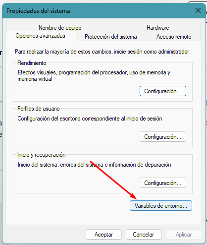

# Primer Reto - Microservicios

## Índice

1. [Crear el proyecto](#Crear-el-proyecto)
2. [Instalación de Java](#Instalación-de-JDK-21)
3. [Importar proyecto](#Importar-y-configurar-IDE)
4. [Consumir](#Consumir-endpoint)
5. [Actuator](#Actuator)

## Crear el proyecto

Se creó el proyecto con Spring initializer

## Instalación de JDK 21

Instalar Java JDK 21

## Importar y configurar IDE

Importar y configurar el IDE para ejecutar el proyecto

## Consumir endpoint

## Actuator

